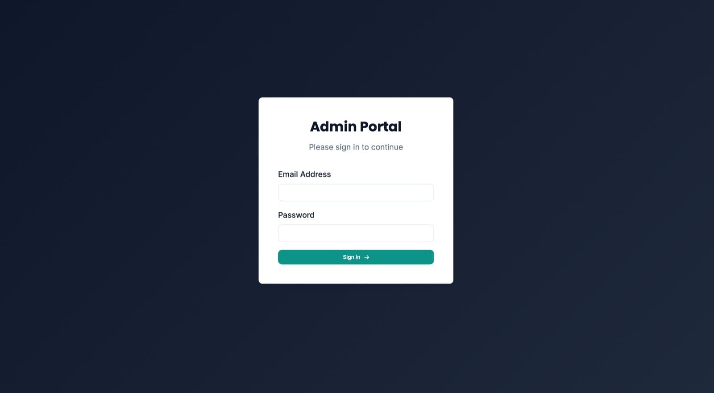
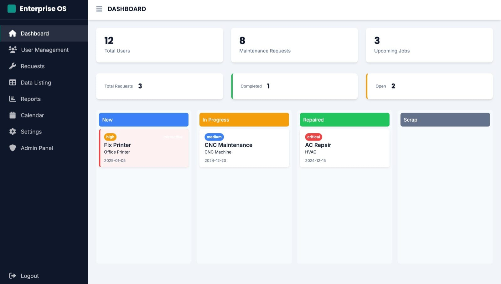
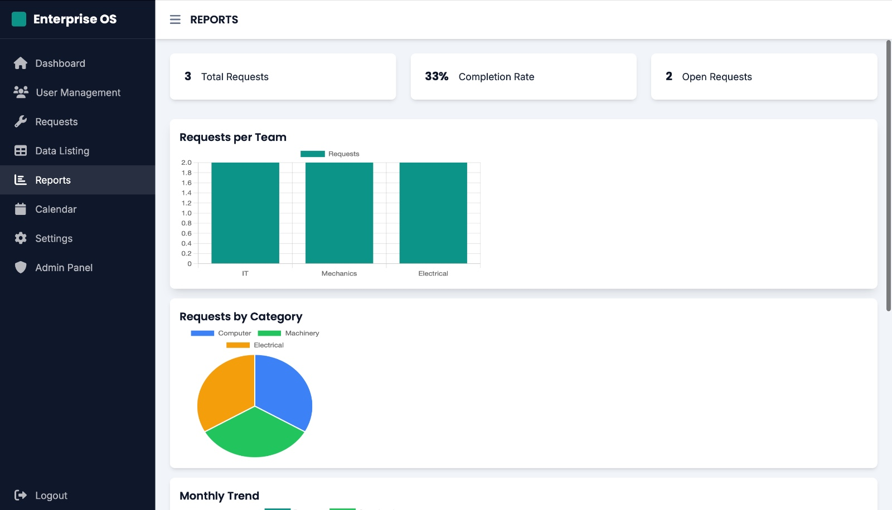

# 🛠️ GearGuard — Enterprise Maintenance Management System

<p align="center">
  
</p>

<p align="center">
  <b>AI-powered enterprise maintenance and workflow management platform</b>
</p>

---

# 🚀 Overview

GearGuard is a smart enterprise maintenance management system designed to streamline maintenance workflows, request tracking, scheduling, reporting, and administrative operations through a centralized dashboard.

Built during a Virtual Hackathon, the platform focuses on improving operational efficiency, maintenance monitoring, and team coordination inside organizations.

---

# ✨ Key Features

- 🔐 Secure Admin Authentication System
- 📊 Interactive Analytics Dashboard
- 🛠️ Maintenance Request Management
- 👥 User & Team Management
- 📅 Smart Calendar Scheduling
- 📈 Reports and Data Visualization
- ⚡ Real-Time Status Tracking
- 🔔 Notification & Alert System
- 🧑‍💼 Admin Control Panel
- 📂 Enterprise Data Management

---

# 🖥️ Modules

## 🔑 Authentication System
- Secure login portal for administrators and users

## 📊 Dashboard
- System statistics
- Maintenance request tracking
- Workflow status overview

## 📈 Reports & Analytics
- Monthly trends
- Category-based analysis
- Team performance tracking

## 📅 Calendar Scheduling
- Maintenance scheduling interface
- Upcoming task management

## ⚙️ Settings & Notifications
- Profile settings
- Alert management
- System preferences

## 🧑‍💼 Admin Panel
- User management
- Audit logs
- System monitoring

---

# 🛠️ Tech Stack

## Frontend
- HTML
- CSS
- JavaScript

## Backend
- Python / Flask

## Database
- SQLite / MySQL

## Visualization
- Chart.js

---

# 📸 Screenshots

## 🔐 Login Portal



---

## 📊 Dashboard



---

## 📈 Reports & Analytics



---

## 📅 Calendar Module


---

## ⚙️ Settings Panel


---

## 🧑‍💼 Admin Panel


---

# 🚀 Installation

```bash
git clone https://github.com/YOUR_USERNAME/gearguard-enterprise-os.git
```

```bash
cd gearguard-enterprise-os
```

```bash
pip install -r requirements.txt
```

```bash
python app.py
```

---

# 💡 Future Enhancements

- 🤖 AI-based predictive maintenance
- 📱 Mobile responsive application
- ☁️ Cloud deployment
- 🔐 Role-based authentication
- 📊 Advanced analytics & reporting
- 📡 Real-time notifications

---

# 👨‍💻 Team & Hackathon

Developed as part of a Virtual Hackathon project focused on smart enterprise workflow automation and maintenance optimization.

---

# ⭐ Support

If you like this project, consider giving it a ⭐ on GitHub!
